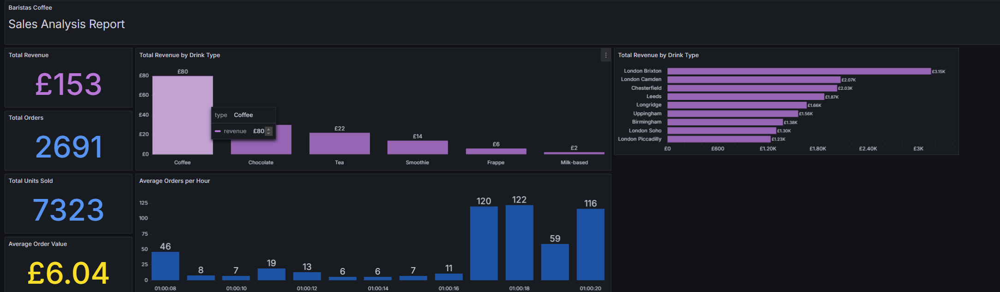
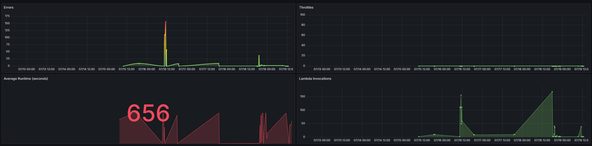
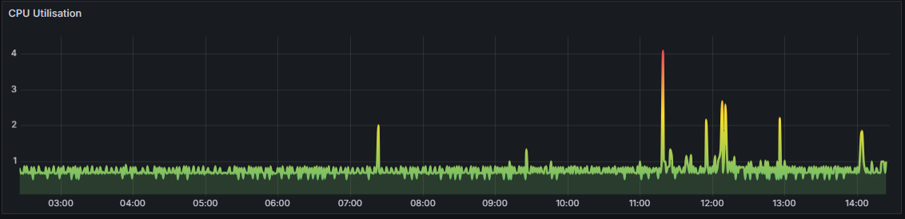
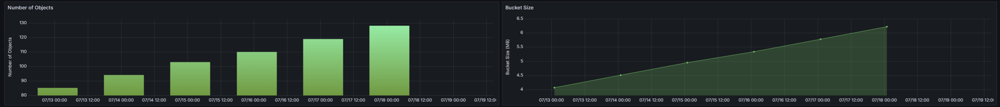

# Data Baristas

**Data Baristas** is a bootcamp project that serves as a comprehensive demonstration of building an end-to-end data pipeline, from a proof of concept (PoC) to a full-fledged implementation on AWS. The project showcases our ability to create an Extract, Transform, Load (ETL) pipeline, visualise the data, and provide actionable insights for a large café chain.

## Project Overview

### Proof of Concept (PoC)

We initiated this project by developing a Proof of Concept (PoC) using Python scripts to build an ETL pipeline. During the PoC phase, we leveraged Docker to set up a local database environment, which allowed us to test the ETL processes effectively. The goal was to ensure that our data extraction, transformation, and loading processes were sound before scaling the solution.

- **Technologies Used:** Python, Docker, Adminer
- **Key Milestones:**
  - Developed Python scripts for data extraction, transformation, and loading.
  - Utilised Docker to create a containerized environment for the database.
  - Successfully completed the PoC by ensuring all components worked seamlessly together.

### Transition to AWS

After validating our approach with the PoC, we transitioned the entire project to AWS. This involved setting up the ETL pipeline on AWS Lambda, storing data in S3 buckets, and loading it into Redshift for analysis. We also integrated Grafana to visualise the processed data, allowing us to derive valuable insights and provide data-driven decisions for the café chain.

- **Technologies Used:** AWS Lambda, AWS S3, AWS Redshift, AWS CloudFormation, AWS CloudWatch, AWS EC2, Grafana
- **Key Milestones:**
  - Migrated Python scripts to AWS Lambda for scalable data processing.
  - Set up S3 buckets for data storage and integrated them with Lambda functions.
  - Loaded processed data into Redshift for further analysis.
  - Visualised the data using Grafana to create dashboards and reports.

## Technologies Used

### Development & Version Control
- **GitHub:** Used for version control, managing CI/CD pipelines, and handling workflows.
- **Pytest:** Employed for unit testing and ensuring code quality throughout the project.

### AWS Services
- **S3:** For storage of raw and processed data.
- **Lambda:** For executing the ETL processes in a serverless environment.
- **Redshift:** As the data warehouse for storing and querying transformed data.
- **CloudFormation:** Used to manage and provision AWS infrastructure as code.
- **CloudWatch:** For monitoring the AWS resources and logging.
- **EC2:** To provide additional compute resources when needed.
- **Grafana:** To create interactive dashboards and visualisations.

  

## Grafana Visualisations

This section is reserved for adding screenshots of the Grafana dashboards and visualisations we created as part of this project. These visuals illustrate the insights we were able to draw from the processed data, highlighting trends, patterns, and other key metrics for the café chain.

## Authors

- [@b-the-bee - Sam B](https://github.com/b-the-bee)
- [@Anas9071 - Anas A](https://github.com/Anas9071)
- [@mara557 - Marko G](https://github.com/mara557)
- [@keithu-data - Keith U](https://github.com/keithu-data)
- [@mvchikolo - Muhammad V](https://github.com/mvchikolo)
