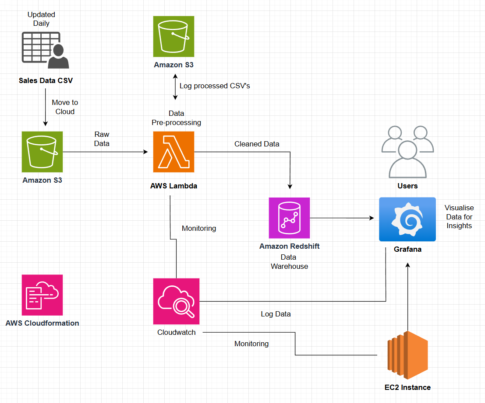

# Data Baristas

Software written in Python to Extract, Transform, Load, and Analyze data in AWS for a large café chain.


## Authors

- [@b-the-bee - Sam B](https://github.com/b-the-bee)
- [@Anas9071 - Anas A](https://github.com/Anas9071)
- [@mara557 - Marko G](https://github.com/mara557)
- [@keithu-data - Keith U](https://github.com/keithu-data)
- [@mvchikolo - Muhammad V](https://github.com/mvchikolo)


## Project Background

This project uses Python running on AWS Lambda to extract data from an S3 bucket, transform it within the Lambda, and load the data into Redshift using SQS with a different Lambda. The data is then analyzed on an EC2 instance to provide insights, and CloudWatch information is visualized using Grafana.

We started by building a local proof of concept in Visual Studio Code with Python scripts, Docker, and Adminer for database management, and then integrated it into AWS.

## Client Requirements

The client requirements are as follows:

```
Based on the sales data from each branch provided in raw CSV files, for each row in each CSV file you must:
Remove the Customer Name and the Card Number - you should not store those anywhere.
Keep a Cash/Card payment method.
Reorganize the transaction data to split out the individual product from each order. For example, "Regular Flavoured iced latte - Hazelnut - 2.75, Large Latte - 2.45" into separate data rows for reporting, normalize this.
This is because they want reports/graphs/visualizations later, on things like:

How many coffees did we sell, of which type, each week?
Which store had the highest sales each week, or day?
What was the total value of Hazelnut Coffee sales each week, totaled for all stores?
What was the total value of Large Latte sales each day, totaled for all stores?
They also wish you to build visualizations of your cloud architecture performance and operations. 
```
# Installation and Setup

## Requirements
Docker 26.1.1
Python 3.12.1
Pip 24.0
Requirements in the requirements file (details in install instructions)
VSCode or similar IDE
GitBash or another terminal


## Getting Started
1. Download and install Docker.
2. Download and install Python (should contain pip with this version).
3. Extract code from repo download or clone using GitBash or any other terminal (powershell, zsh etc) https://docs.github.com/en/repositories/creating-and-managing-repositories/cloning-a-repository.

## Setting up the database
5. Install the required modules by doing:
```
python -m pip install -r src\requirements.txt
```
## Setting Up CloudFormation Stack
You can either create your own template manually or use the IAC generator tool available within CloudFormation. The instructions below cover both methods, from creating the template to deploying it and integrating it into a GitHub repository.

Prerequisites
AWS account with appropriate permissions to create and manage CloudFormation stacks.
AWS CLI configured with your credentials.
GitHub account with access to the repository where you want to store the infrastructure code.


### 1. Creating a CloudFormation Template
#### Option A: Manually Creating a Template

Define Resources: Start by defining the resources you need in your infrastructure in a YAML or JSON file.

This includes specifying AWS services like EC2 instances, S3 buckets, IAM roles, etc.

Example (YAML):
```
name: Deploy CloudFormation Stack

on:
  push:
    branches:
      - main

jobs:
  deploy:
    runs-on: ubuntu-latest
    steps:
      - name: Checkout code
        uses: actions/checkout@v2
      
      - name: Configure AWS credentials
        uses: aws-actions/configure-aws-credentials@v1
        with:
          aws-access-key-id: ${{ secrets.AWS_ACCESS_KEY_ID }}
          aws-secret-access-key: ${{ secrets.AWS_SECRET_ACCESS_KEY }}
          aws-region: us-east-1
      
      - name: Deploy CloudFormation stack
        run: |
          aws cloudformation deploy \
            --template-file infra/aws-infrastructure.yaml \
            --stack-name my-cloudformation-stack

```
Save the Template: Save this file with a .yaml or .json extension.

#### Option B: Using IAC Generator Tool
Access CloudFormation: Log in to the AWS Management Console and navigate to the CloudFormation service.

Use the IAC generator tool to automatically create a template. 
Follow the on-screen instructions to specify the resources and configurations needed.

Once the template is generated, download it to your local machine.

### 2. Deploying the Template to a CloudFormation Stack
Upload the Template: In the CloudFormation console, click on 'Create Stack' and choose 'With new resources (standard)'.

Specify Template: Upload your template file and click 'Next'.

Configure Stack Details: Enter a stack name and specify any necessary parameters.

Configure Stack Options: Optionally, configure stack options such as tags, IAM roles, and advanced settings.

Review and Create: Review your settings and click 'Create Stack'. Wait for the stack creation to complete.

### 3. Adding the Template to GitHub
Create Infra Folder: In your GitHub repository, create a folder named infra.

```
infra\aws-infrastructure.yaml
```

Upload Template: Add your CloudFormation template file to the infra folder.

### 4. Setting Up GitHub Actions for Deployment
Create Workflow File: In your GitHub repository, create a .github/workflows directory if it doesn't exist. Add a new workflow file (e.g., deploy.yml) inside this directory.

Set Up Secrets: In your GitHub repository, go to 'Settings' > 'Secrets' and add the necessary AWS credentials (AWS_ACCESS_KEY_ID and AWS_SECRET_ACCESS_KEY).


## Using Lambda To Run Code
Add a psycopg2 layer to the Lambda function using this repo [here](https://github.com/jkehler/awslambda-psycopg2).

Paste each module with the correct name into your Lambda function, ensuring the Lambda is pointing to run.py as the lambda function, this can be done by going to the Lambda function -> Configuration -> Runtime Settnings
```
 src\main.py
```


# Running analysis
Using the provided Grafana templates, you can view CloudWatch statistics as well as generate insights into the data


## Running Unit Tests

Unit tests run by default through Github Actions, however if you wish to run them yourself, you can type this command in your terminal:

```sh
$ python -m pytest
```

